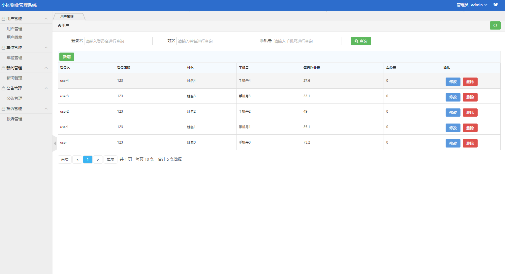
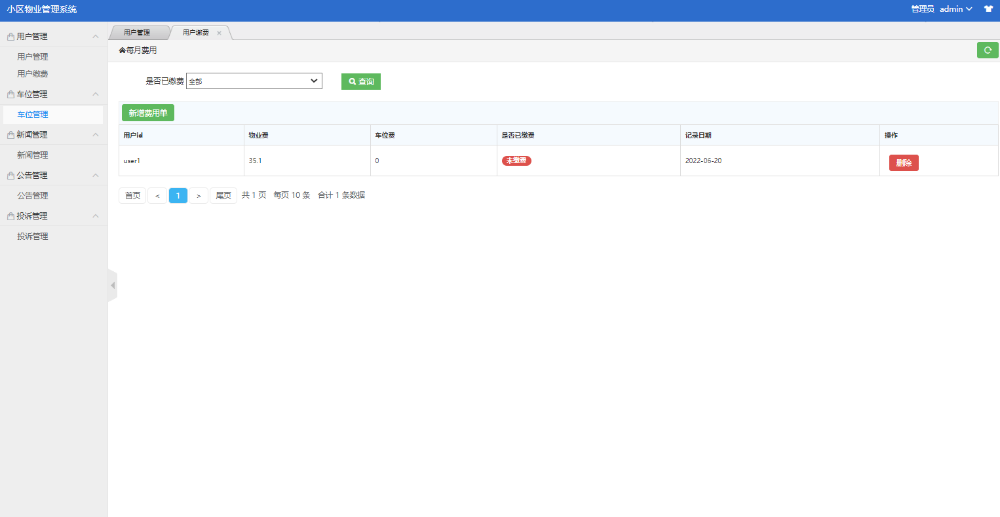
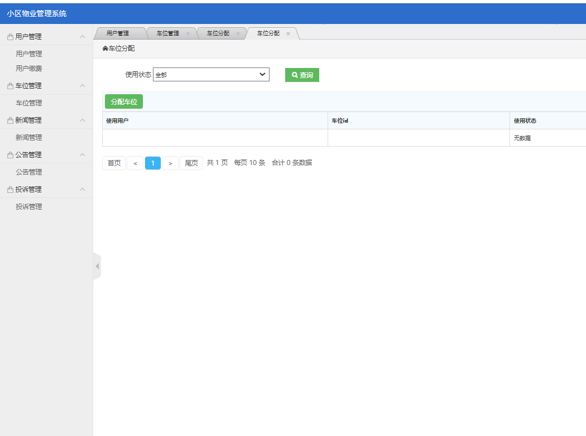
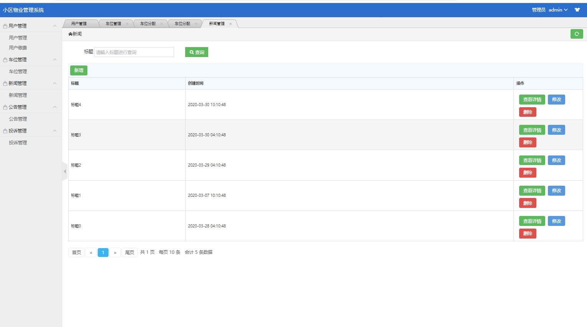
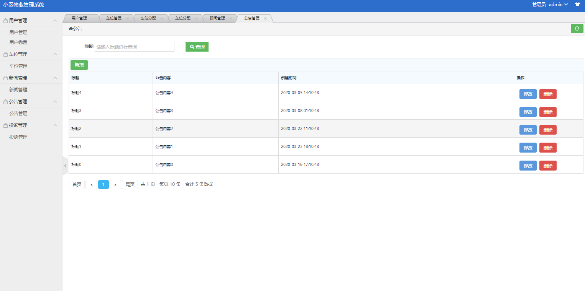
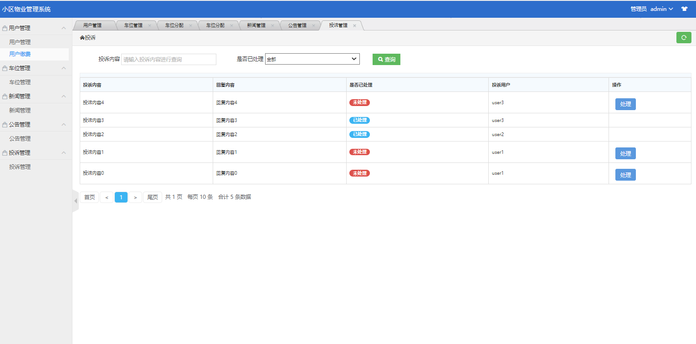
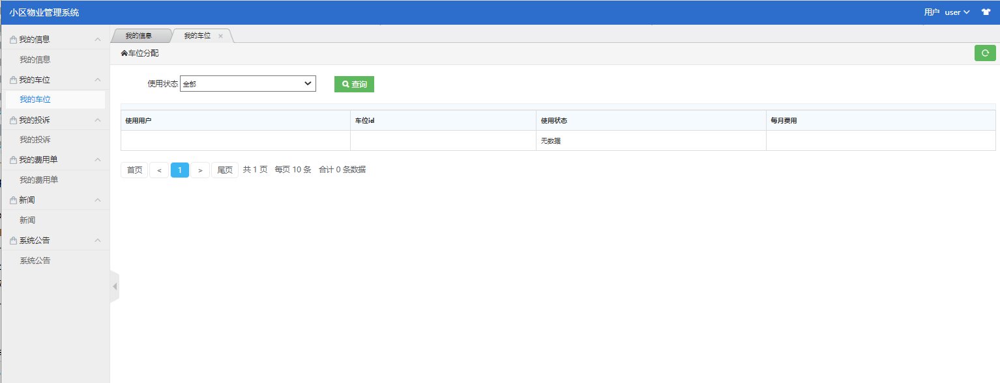
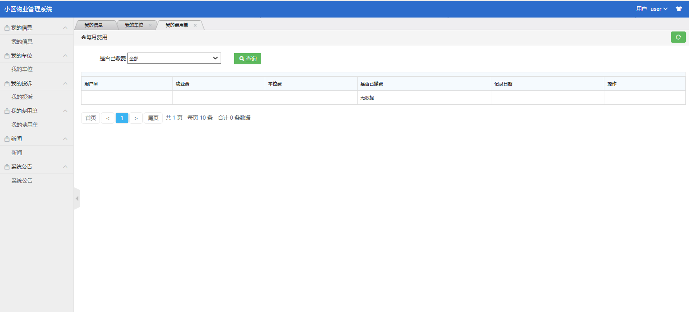
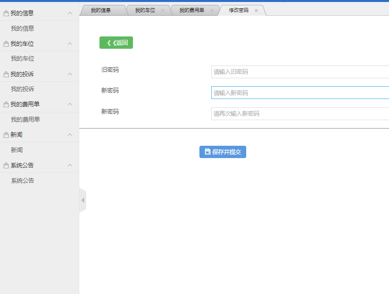

### 作者微信：grapro666 QQ：3642795578 (支持部署调试、支持代做毕设和论文)

### 接javaweb、python、小程序、H5、APP、各种管理系统、单片机、嵌入式等开发

### 选题+开题报告+任务书+程序定制+安装调试+论文+答辩ppt

**博客地址：
[https://blog.csdn.net/2303_76227485/article/details/128701887](https://blog.csdn.net/2303_76227485/article/details/128701887)**

**视频演示：
[https://www.bilibili.com/video/BV1BV4y1y7NX/](https://www.bilibili.com/video/BV1BV4y1y7NX/)**

**毕业设计所有选题地址：
[https://github.com/codegitpro/allProject](https://github.com/codegitpro/allProject)**

## 基于Java+ssm的小区物业管理系统(8000字文档)606

## 一、系统介绍

本项目分为管理员与普通用户两种角色

- 普通用户

  我的信息、我的投诉、我的费用单、新闻查询、公告查询

  管理员

  用户管理、用户缴费、车位管理、新闻管理、公告管理、投诉管理。

## 二、所用技术

- 前端jsp+layui
- 后端基于ssm(Spring+SpringMvc+Mybatis)+mysql

## 三、环境介绍

基础环境 :IDEA/eclipse, JDK 1.8, Mysql5.7,Maven，tomcat8

所有项目以及源代码本人均调试运行无问题 可支持远程调试运行

## 四、页面截图

## 五、浏览地址

http://localhost:8686/estate_master/commonapi/sys_login

管理员 用户名：admin 密码：123

普通用户 用户名：user 密码：123

## 六、安装教程

1. 使用Navicat或者其它工具、在mysql中创建对应名称的数据库、并导入项目的sql文件；
2. 使用IDEA/Eclipse导入项目，若为maven项目请选择maven，导入成功后请执行maven clean;maven install命令
3. 修改src里面的config.properties里面的数据库配置
4. 将项目加入到tomcat容器里面，启动项目 
